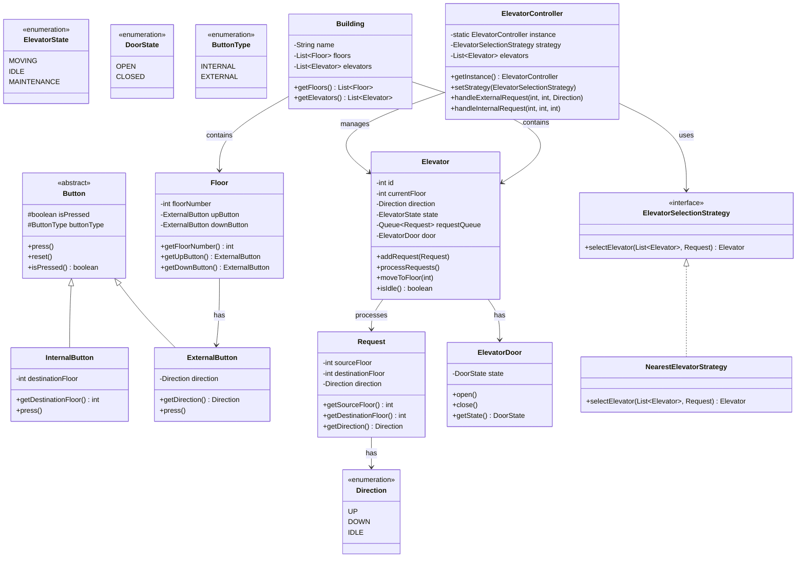

# 🏢 Elevator System – Low Level Design (LLD)

A clean, pattern-driven implementation of an **Elevator System** in Java.

---

## 📐 Class Diagram

```mermaid
classDiagram
    direction TB

    class Direction {
        <<enumeration>>
        UP
        DOWN
        IDLE
    }

    class ElevatorState {
        <<enumeration>>
        MOVING
        IDLE
        MAINTENANCE
    }

    class DoorState {
        <<enumeration>>
        OPEN
        CLOSED
    }

    class ButtonType {
        <<enumeration>>
        INTERNAL
        EXTERNAL
    }

    class Button {
        <<abstract>>
        #boolean isPressed
        #ButtonType buttonType
        +press()
        +reset()
        +isPressed() boolean
    }

    class InternalButton {
        -int destinationFloor
        +getDestinationFloor() int
        +press()
    }

    class ExternalButton {
        -Direction direction
        +getDirection() Direction
        +press()
    }

    Button <|-- InternalButton
    Button <|-- ExternalButton

    class Request {
        -int sourceFloor
        -int destinationFloor
        -Direction direction
        +getSourceFloor() int
        +getDestinationFloor() int
        +getDirection() Direction
    }

    class Floor {
        -int floorNumber
        -ExternalButton upButton
        -ExternalButton downButton
        +getFloorNumber() int
        +getUpButton() ExternalButton
        +getDownButton() ExternalButton
    }

    class ElevatorDoor {
        -DoorState state
        +open()
        +close()
        +getState() DoorState
    }

    class Elevator {
        -int id
        -int currentFloor
        -Direction direction
        -ElevatorState state
        -Queue~Request~ requestQueue
        -ElevatorDoor door
        +addRequest(Request)
        +processRequests()
        +moveToFloor(int)
        +isIdle() boolean
    }

    class Building {
        -String name
        -List~Floor~ floors
        -List~Elevator~ elevators
        +getFloors() List~Floor~
        +getElevators() List~Elevator~
    }

    class ElevatorSelectionStrategy {
        <<interface>>
        +selectElevator(List~Elevator~, Request) Elevator
    }

    class NearestElevatorStrategy {
        +selectElevator(List~Elevator~, Request) Elevator
    }

    class ElevatorController {
        -static ElevatorController instance
        -ElevatorSelectionStrategy strategy
        -List~Elevator~ elevators
        +getInstance() ElevatorController
        +setStrategy(ElevatorSelectionStrategy)
        +handleExternalRequest(int, int, Direction)
        +handleInternalRequest(int, int, int)
    }

    ElevatorSelectionStrategy <|.. NearestElevatorStrategy
    ElevatorController --> ElevatorSelectionStrategy : uses
    ElevatorController --> Elevator : manages
    Building --> Floor : contains
    Building --> Elevator : contains
    Floor --> ExternalButton : has
    Elevator --> ElevatorDoor : has
    Elevator --> Request : processes
    Request --> Direction : has
```
