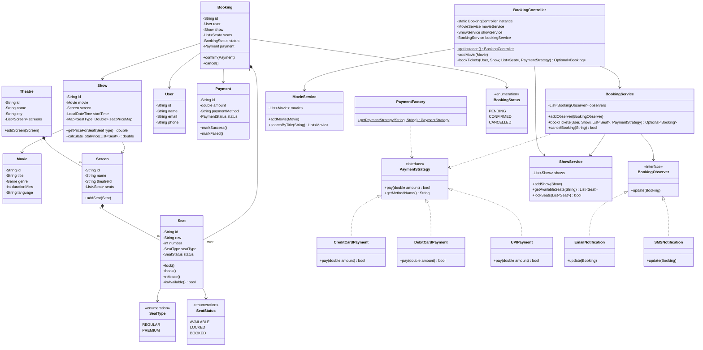

# 🎬 Movie Ticket Booking System – LLD

A **Low-Level Design (LLD)** implementation of a movie ticket booking system in Java, demonstrating SOLID principles and common design patterns.

---

## 📐 Class Diagram



---

## 🎯 Design Patterns Used

| Pattern | Class(es) | Description |
|---|---|---|
| **Singleton** | `BookingController` | Only one instance manages the entire system |
| **Strategy** | `PaymentStrategy`, `CreditCardPayment`, `DebitCardPayment`, `UPIPayment` | Interchangeable payment methods without changing BookingService |
| **Observer** | `BookingObserver`, `EmailNotification`, `SMSNotification` | Notify interested parties when a booking is confirmed |
| **Factory** | `PaymentFactory` | Decouples payment creation from the caller |
| **Facade** | `BookingController` | Simplifies access to the subsystem (MovieService, ShowService, BookingService) |

---

## 📐 SOLID Principles

| Principle | How Applied |
|---|---|
| **SRP** | Each class has a single job (`Seat` handles seat state, `BookingService` handles booking logic) |
| **OCP** | New payment methods extend `PaymentStrategy` without touching existing code |
| **LSP** | All `PaymentStrategy` implementations are fully substitutable |
| **ISP** | `BookingObserver` and `PaymentStrategy` are separate focused interfaces |
| **DIP** | `BookingService` depends on `PaymentStrategy` interface, not concrete classes |

---

## 📁 Project Structure

```
src/
└── moviebooking/
    ├── enums/          → SeatType, SeatStatus, BookingStatus, Genre, PaymentStatus
    ├── models/         → Movie, Theatre, Screen, Seat, Show, User, Booking, Payment
    ├── payment/        → PaymentStrategy (interface), CreditCardPayment, DebitCardPayment, UPIPayment, PaymentFactory
    ├── notification/   → BookingObserver (interface), EmailNotification, SMSNotification
    ├── service/        → MovieService, ShowService, BookingService
    ├── controller/     → BookingController (Singleton + Facade)
    └── Main.java       → Demo runner
```

---

## 🚀 How to Run

```bash
# From the project root (Movie Booking System/)
javac -d out src/moviebooking/enums/*.java src/moviebooking/models/*.java src/moviebooking/payment/*.java src/moviebooking/notification/*.java src/moviebooking/service/*.java src/moviebooking/controller/*.java src/moviebooking/Main.java

java -cp out moviebooking.Main
```

---

## 🔑 Key Features

- 🎟️ Browse movies and shows
- 💺 Real-time seat availability check
- 🔒 Atomic seat locking to prevent double-booking
- 💳 Multiple payment methods (UPI / Credit Card / Debit Card)
- 📧 Email & SMS notifications on booking confirmation
- ❌ Booking cancellation with seat release
